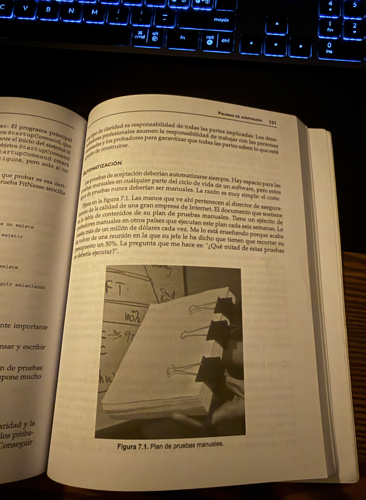
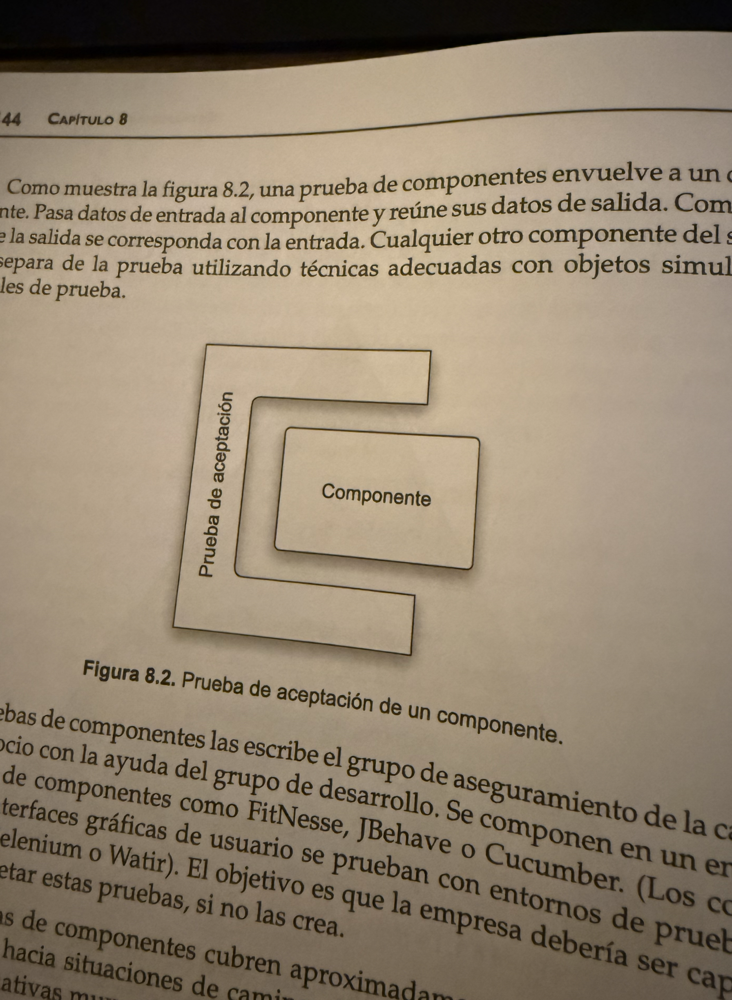
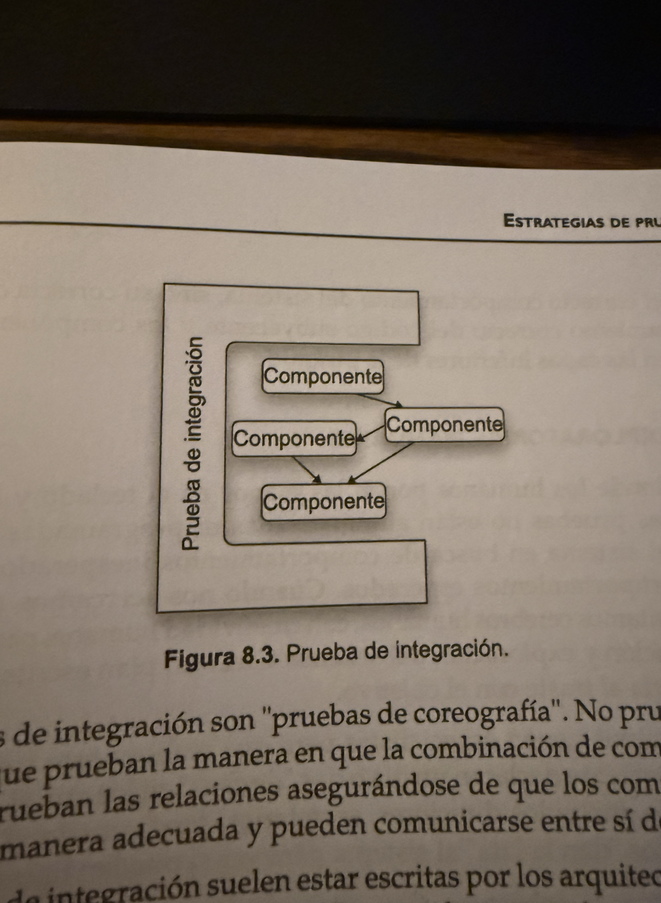
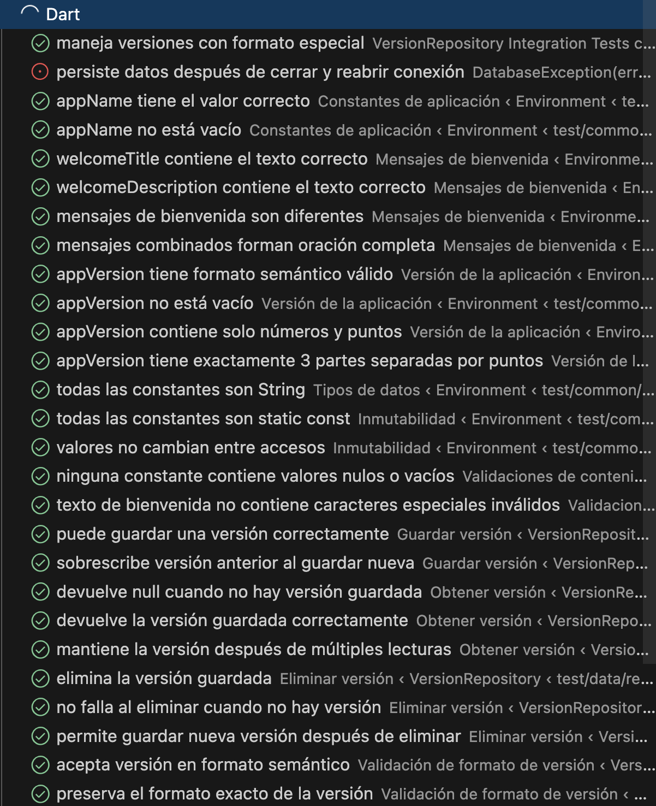
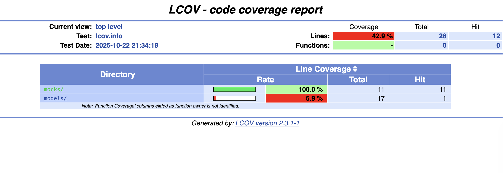
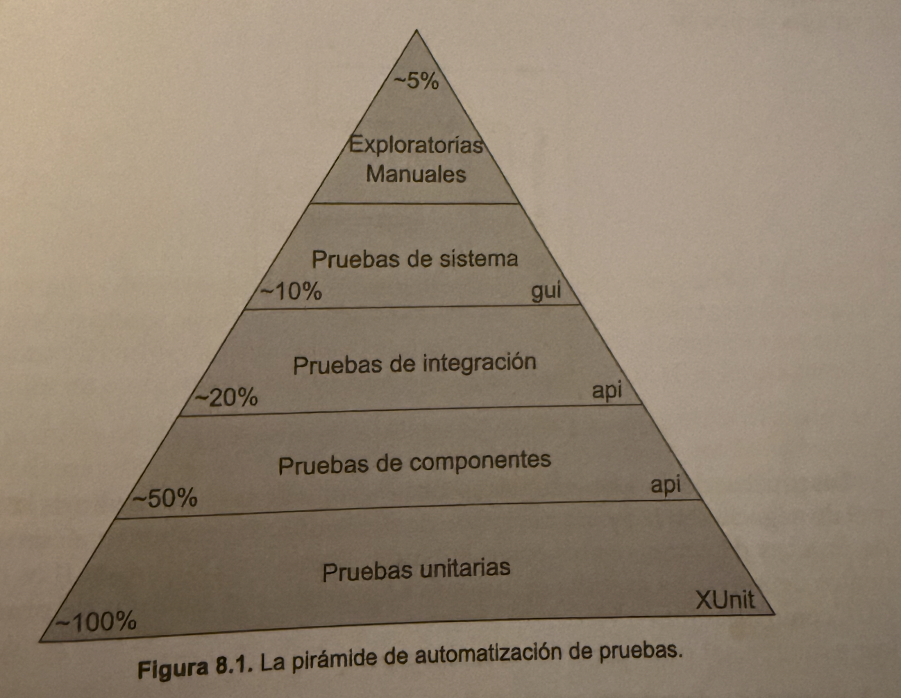
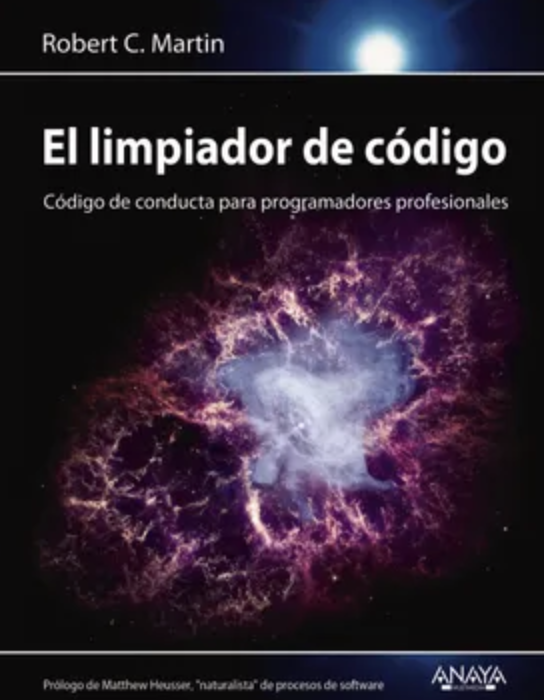

## 📚 Tabla de Contenido: Unit Testing e integration test (en 15 a 20 Minutos)

| ⏱️ Tiempo | 🎯 Tema | 📝 Descripción | 🔧 Acción |
|-----------|---------|----------------|-----------|
| **0-4 min** | **¿Qué son los Unit Tests?** | Introducción a las pruebas unitarias y su importancia en el desarrollo | Entender conceptos básicos |
| **2-3 min** | **Estructura básica de un test** | Sintaxis: `test()`, `expect()`, `group()` | Veamos un test en detalle |
| **2-3 min** | **Agrupación de tests** | Usar `group()` para organizar tests relacionados | Estructurar suite de tests |
| **9-10 min** | **Ejecución y coverage** | Correr tests y verificar cobertura de código | `flutter test --coverage` |

# Plan de la Clase

Automatizar

Las pruebas de aceptación: 

· Las pruebas de aceptación (Acceptance Testing) son un tipo de prueba de software que verifica si el sistema cumple con los requisitos del negocio y si está listo para ser entregado al usuario final o cliente.

Nunca deberian hacerse manualmente según Robert C Martin

La pregunta es ¿Que parte del 50% deseas que deje de probar?

# Unit test e integration test

con Unit test pruebas un componente

con Integration test pruebas como se relaciona ese componente con otros

# Estructura básica de un test

El patrón AAA (Arrange-Act-Assert) es una estructura estándar para organizar y escribir pruebas unitarias de manera clara y consistente.

Las 3 fases del patrón AAA:

1. Arrange (Preparar)
- Configura el escenario de la prueba
- Inicializa objetos, variables y dependencias
- Prepara los datos necesarios

2. Act (Actuar)
- Ejecuta la acción que quieres probar
- Llama al método o función bajo prueba
- Es generalmente una sola línea de código

3. Assert (Afirmar)
- Verifica que el resultado es el esperado
- Comprueba que el comportamiento fue correcto
- Usa expect() para validar

# Agrupación de tests

- La Agrupación de tests es una técnica para organizar múltiples pruebas relacionadas bajo un mismo contexto usando la función group().

- Nos permite habilitar o deshabilitar un grupo de pruebas

al probarlo lo vemos así:

# Al final podemos ejecutar el coverage

- Esto nos ayuda para entender el porcentaje de pruebas en las cuales tenemos cobertura

# Posibles errores

- Creer que el 100% es lo adecuado
- Realizar pruebas de Widgets con funcionalidades que cambian constantemente
- Realizar pruebas que no generan valor

# Durante la sesión

Nos olvidamos de incluir porcentaje de pruebas

Libro de fuentes

